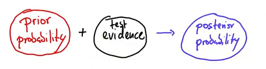
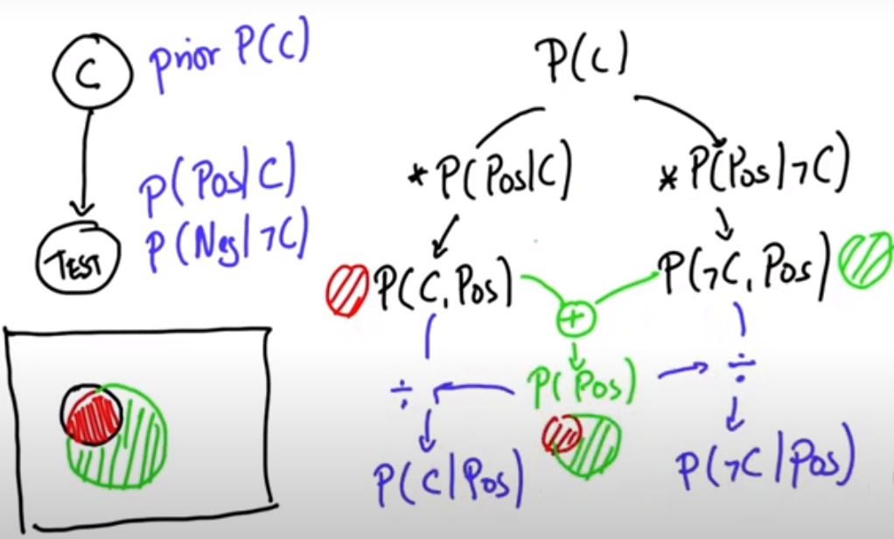

# Bayes Rule

_I will be using rule and theorem interchangeably._

> Check 3b1b and Vertasium YouTube channels, they contains previous video about this theorem.

$$
P(H \mid E) = \frac{P(H) \cdot P(E\mid H)}{P(E)}
$$

A more human-readable version of this equation is: **Posterior = Prior × Likelihood ÷ Evidence**. You can think of Bayes' rule as a way to reverse the conditional probability: $P(H\mid E) \Leftrightarrow P(E \mid H)$.

In Bayes's rule:

- **Prior** ,$P(A)$, refers to the probability of an event occurring before any new evidence is taken into account.
- **Sensitivity**, $P(E \mid H)$, refers to the probability that a test will correctly identify individuals who have a particular condition or disease.
- **Specificity** ,$P(\neg E \mid \neg H)$, refers to the probability that a test will correctly identify individuals who do not have a particular condition or disease.
- **Posterior** ,$P(H \mid E)$, is the revised or updated probability of an event occurring after taking into consideration new information.

These concepts are important in Bayesian inference, which involves updating prior probabilities based on new evidence to arrive at posterior probabilities.

An awesome quot from Grant Sanderson (3b1b) about the theorem:

> The key mantra underlying Bayes' theorem, is that new evidence don't completely change your beliefs in a vacuum; it should update prior beliefs.

We can summarize the theorem as depicted in the above diagram. Using prior probability and a test, we can know what is called posterior probability.

## Example

### Disease test

How likely you have a cancer if the test is positive?

If you know the following information we may be able to answer this question:

| Description                                                                   | Notation           | Value  |
| ----------------------------------------------------------------------------- | ------------------ | ------ |
| Probability that someone has cancer                                           | $P(C)$             | $1\%$  |
| Probability that the test is +ve given that the person have cancer            | $P(P \mid C)$      | $90\%$ |
| Probability that the test is -ve given that the person does _NOT_ have cancer | $P(N \mid \neg C)$ | $90\%$ |

Now, let's rephrase the question: **What is the probability that the person has cancer is the test is positive?**

Such a useful question can be answer using Bayes' theorem.

$$
P(C \mid P) = \frac{P(C) \cdot P(P\mid C)}{P(P)} = \frac 1 {12} = 8.33\%
$$

- $P(P)$ is the total probability of a test being +ve which is equivalent to $P(C)\cdot P(P\mid C) + P(\neg C)\cdot P(P \mid \neg C)$.

